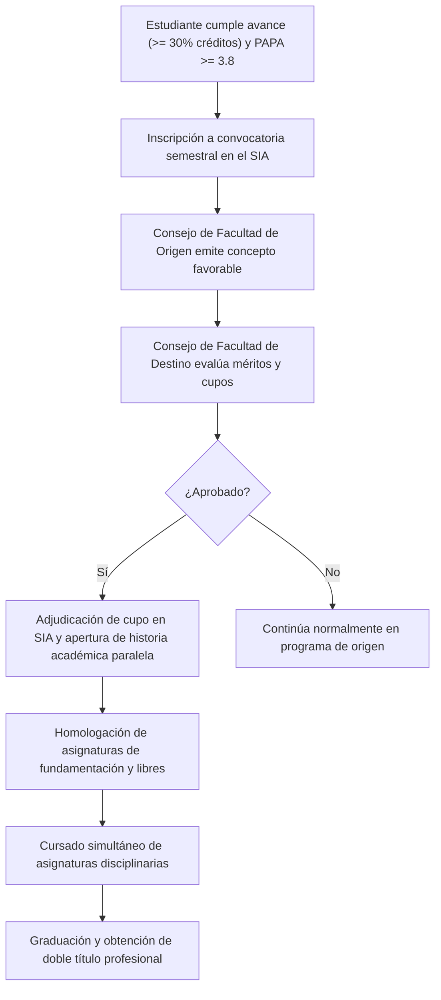

# Acuerdo 155 de 2014 del Consejo Superior Universitario - Reglamentación del Programa de Doble Titulación

## 📌 Ficha Técnica y Enlace Canónico
- **Documento Oficial**: Acuerdo 155 de 2014 (Acta 06 del 24 de junio)
- **Emisor**: Consejo Superior Universitario (CSU)
- **Enlace canónico en Régimen Legal**: [https://legal.unal.edu.co/rlunal/home/doc.jsp?d_i=73205](https://legal.unal.edu.co/rlunal/home/doc.jsp?d_i=73205)
- **Denominación**: *Por el cual se reglamenta el programa de Doble Titulación en la Universidad Nacional de Colombia y se derogan normas anteriores.*

---

## 🎯 Objeto y Resumen Ejecutivo para RAG
El **Acuerdo 155 de 2014 CSU** es la norma principal que regula las condiciones, requisitos y procedimientos para que un estudiante de pregrado curse simultáneamente dos programas curriculares de pregrado en la Universidad Nacional de Colombia (por ejemplo: **Ingeniería de Sistemas y Computación + Ciencias de la Computación**, o **Ingeniería de Sistemas + Matemáticas / Estadística / Ingeniería Electrónica / Industrial**).

### Aspectos Esenciales Regulados:
1. **Condición de Estudiante**: Se mantiene una única matrícula activa con derechos académicos plenos en ambos programas.
2. **Requisitos de Postulación**:
   - Estar matriculado formalmente como estudiante regular en el programa de origen.
   - Haber cursado y aprobado al menos el **30% al 40% de los créditos** del plan de estudios de origen (definido por el Consejo de Facultad receptor).
   - Poseer un **PAPA (Promedio Aritmético Ponderado Acumulado) igual o superior al umbral fijado** por la facultad receptora (típicamente $\ge 3.8$ o $4.0$).
   - No haber sido sancionado disciplinariamente.
   - Existencia de **cupos disponibles** en la convocatoria semestral aprobada por el Consejo de Sede.
3. **Mecanismo de Convalidación y Homologación**:
   - Las asignaturas del Componente de Fundamentación aprobadas en el primer programa que coincidan con las del segundo programa son convalidadas de forma inmediata.
   - Los créditos cursados en asignaturas afines pueden imputarse al Componente de Libre Elección de cualquiera de los dos planes.
4. **Graduación**:
   - El estudiante puede graduarse de ambos programas al mismo tiempo o graduarse primero de uno y continuar con los créditos pendientes del segundo programa.
   - Para obtener los dos títulos, debe haber cumplido el 100% de los requisitos de ambos planes de estudio, incluidos los respectivos Trabajos de Grado.

---

## 🔄 Procedimiento Paso a Paso para Estudiantes (Flujo RAG)

---

## ❓ Preguntas Frecuentes para Motores RAG (Q&A)

**P: ¿Cuáles son los requisitos generales para solicitar doble titulación en la UNAL según el Acuerdo 155 de 2014?**  
*R: Estar matriculado como estudiante regular, haber aprobado el porcentaje de créditos mínimo (al menos 30%-40%), tener un PAPA sobresaliente (generalmente >= 3.8 o 4.0 según la facultad receptora), que existan cupos disponibles y recibir la aprobación de los Consejos de Facultad correspondientes.*

**P: ¿Cómo se manejan los créditos de las materias comunes entre dos carreras en doble titulación?**  
*R: Las asignaturas comunes (especialmente del Componente de Fundamentación en ciencias básicas y matemáticas) se homologan o convalidan directamente en la segunda carrera, reduciendo significativamente la carga de créditos requerida.*
