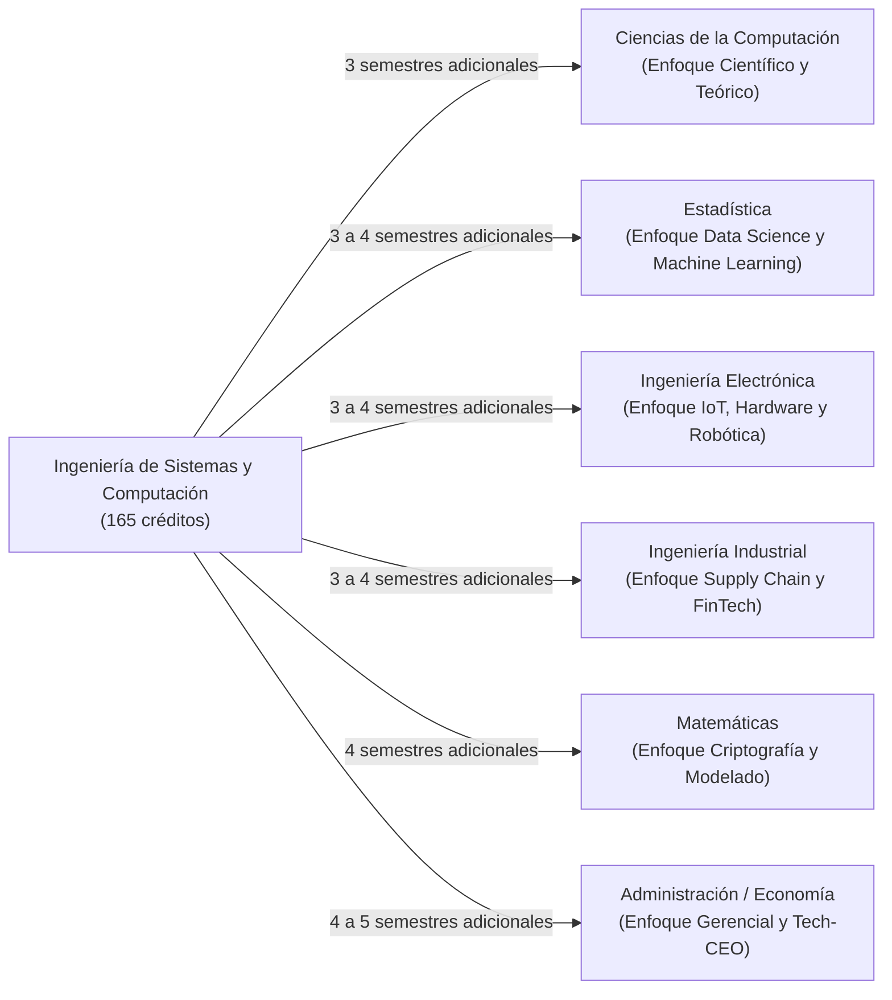

# Guía Maestra de Doble Titulación: Ingeniería de Sistemas y Computación con Otras Carreras (UNAL Bogotá)

El régimen de **Doble Titulación** en la Universidad Nacional de Colombia está formalmente regulado por el **[Acuerdo 155 de 2014 del Consejo Superior Universitario](https://legal.unal.edu.co/rlunal/home/doc.jsp?d_i=73205)**. Permite a los estudiantes activos de **Ingeniería de Sistemas y Computación (Sede Bogotá)** cursar simultáneamente una segunda carrera de pregrado y graduarse con **dos títulos profesionales independientes**.

---

## 📋 1. Requisitos Formales para Postularse a Doble Titulación

Para que el Consejo de Facultad apruebe la solicitud en las convocatorias semestrales del SIA, el estudiante debe cumplir:

1. **Estar matriculado como estudiante regular** en Ingeniería de Sistemas y Computación.
2. **Avance en Créditos**: Haber aprobado al menos el **30% al 40% de los créditos** del plan de estudios de Sistemas (aproximadamente entre 50 y 66 créditos aprobados).
3. **Promedio Académico (PAPA)**:
   - Para postularse dentro de la **Facultad de Ingeniería** (ej. hacia Electrónica o Industrial): PAPA mínimo de **4.0**.
   - Para postularse hacia la **Facultad de Ciencias** (ej. hacia Ciencias de la Computación, Matemáticas o Estadística): PAPA mínimo de **3.8 a 4.0**.
   - Para postularse hacia la **Facultad de Ciencias Económicas** (Administración o Economía): PAPA mínimo de **3.8 a 4.0**.
4. **No registrar sanciones disciplinarias**.
5. **Disponibilidad de cupos**: El Consejo de Sede Bogotá define la cantidad de cupos disponibles semestralmente por cada programa receptor.

---

## 🎯 2. Análisis Detallado Carrera por Carrera

---

### A. Doble Titulación con Ciencias de la Computación (Facultad de Ciencias - Sede Bogotá)
* **Compatibilidad Curricular**: **~90% (La más alta de toda la universidad)**.
* **Perfil Profesional Resultante**: El perfil más completo del mercado: capacidad de construir software a gran escala y robustez en teoría de autómatas, complejidad, compiladores y matemáticas puras.
* **Materias Nucleares Comunes (Homologables Directas)**:
  - Todos los cálculos (Diferencial, Integral, Varias Variables), Álgebra Lineal, Ecuaciones Diferenciales, Físicas I y II, Probabilidad, Matemáticas Discretas I y II.
  - Programación de Computadores, POO, Estructuras de Datos, Algoritmos, Arquitectura de Computadores, Sistemas Operativos, Redes, Bases de Datos, Inteligencia Artificial.
* **Materias Faltantes a Cursar**:
  - *Teoría de Autómatas y Lenguajes Formales* (4 cr)
  - *Compiladores e Intérpretes* (4 cr)
  - *Lógica Computacional* (3 cr)
  - *Álgebra Abstracta* (4 cr)
  - *Optativas disciplinares teóricas* (12 cr)
  - *Trabajo de Grado de Ciencias de la Computación* (6 cr)
* **Tiempo Adicional Estimado**: **3 semestres** (~45 créditos adicionales aprovechando la Libre Elección).

---

### B. Doble Titulación con Estadística (Facultad de Ciencias - Sede Bogotá)
* **Compatibilidad Curricular**: **~75%**.
* **Perfil Profesional Resultante**: El estándar de oro para **Científico de Datos Senior (Data Scientist)**, **Ingeniero de Machine Learning (MLOps)** y especialista en Inteligencia Artificial Generativa.
* **Materias Nucleares Comunes**:
  - Cálculo Diferencial, Integral, Varias Variables, Álgebra Lineal, Programación, Algoritmos, Bases de Datos, Probabilidad y Estadística Fundamental.
* **Materias Faltantes a Cursar**:
  - *Inferencia Estadística* (4 cr)
  - *Modelos Lineales y Regresión Avanzada* (4 cr)
  - *Teoría de Muestreo* (3 cr)
  - *Procesos Estocásticos* (4 cr)
  - *Análisis Multivariado de Datos* (4 cr)
  - *Series de Tiempo y Pronósticos* (4 cr)
  - *Bioestadística o Minería de Datos Estadísticos* (3 cr)
  - *Trabajo de Grado de Estadística* (6 cr)
* **Tiempo Adicional Estimado**: **3 a 4 semestres** (~50 a 60 créditos adicionales).

---

### C. Doble Titulación con Ingeniería Electrónica (Facultad de Ingeniería - Sede Bogotá)
* **Compatibilidad Curricular**: **~75% (Misma Facultad)**.
* **Perfil Profesional Resultante**: Especialista en **Internet de las Cosas (IoT)**, **Robótica Autónoma**, **Hardware Inteligente**, **Sistemas Embebidos** y **Ciberseguridad de Infraestructuras Críticas**.
* **Materias Nucleares Comunes**:
  - Todas las matemáticas y físicas de la Facultad de Ingeniería (52 créditos de fundamentación idénticos).
  - Programación, POO, Arquitectura de Computadores, Redes de Comunicación, Sistemas Operativos.
* **Materias Faltantes a Cursar**:
  - *Circuitos Eléctricos I y II* (8 cr)
  - *Electrónica Análoga I y II* (8 cr)
  - *Señales y Sistemas* (4 cr)
  - *Sistemas de Control Automático* (4 cr)
  - *Comunicaciones y Ondas Electromagnéticas* (4 cr)
  - *Microcontroladores y DSP* (3 cr)
  - *Trabajo de Grado de Electrónica* (6 cr)
* **Tiempo Adicional Estimado**: **3 a 4 semestres** (~55 a 65 créditos adicionales).

---

### D. Doble Titulación con Ingeniería Industrial (Facultad de Ingeniería - Sede Bogotá)
* **Compatibilidad Curricular**: **~65% (Misma Facultad)**.
* **Perfil Profesional Resultante**: **Líder de Producto Digital (Product Manager)**, arquitecto de **FinTech**, optimización de cadenas de suministro (Supply Chain) mediante IA y consultor de transformación digital.
* **Materias Nucleares Comunes**:
  - Fundamentación completa de ingeniería en matemáticas y físicas.
  - Programación de computadores, Bases de Datos, Modelos y Simulación.
* **Materias Faltantes a Cursar**:
  - *Investigación de Operaciones I y II (Programación Lineal y Estocástica)* (6 cr)
  - *Ingeniería Económica y Finanzas* (4 cr)
  - *Gestión y Control de Calidad* (3 cr)
  - *Logística y Cadenas de Suministro* (3 cr)
  - *Diseño de Procesos y Ergonomía* (3 cr)
  - *Gestión Organizacional y Talento* (3 cr)
  - *Trabajo de Grado de Industrial* (6 cr)
* **Tiempo Adicional Estimado**: **3 a 4 semestres** (~55 a 60 créditos adicionales).

---

### E. Doble Titulación con Matemáticas (Facultad de Ciencias - Sede Bogotá)
* **Compatibilidad Curricular**: **~60%**.
* **Perfil Profesional Resultante**: Criptógrafo, investigador en Computación Cuántica, matemático computacional y modelador de algoritmos complejos de alta precisión.
* **Materias Nucleares Comunes**:
  - Todos los cálculos (Diferencial, Integral, Varias Variables), Álgebra Lineal, Ecuaciones Diferenciales, Matemáticas Discretas, Programación y Métodos Numéricos.
* **Materias Faltantes a Cursar**:
  - *Álgebra Abstracta I y II (Grupos, Anillos, Cuerpos y Galois)* (8 cr)
  - *Análisis Real I y II (Espacios Métricos y Medida de Lebesgue)* (8 cr)
  - *Topología General* (4 cr)
  - *Variable Compleja* (4 cr)
  - *Geometría Diferencial* (4 cr)
  - *Trabajo de Grado en Matemáticas* (6 cr)
* **Tiempo Adicional Estimado**: **4 semestres** (~65 a 70 créditos adicionales).

---

### F. Doble Titulación con Administración de Empresas o Economía (Facultad de Ciencias Económicas)
* **Compatibilidad Curricular**: **~45%**.
* **Perfil Profesional Resultante**: Fundador de Startups tecnológicas (CEO / CTO), consultor de banca de inversión tecnológica, economista computacional y diseñador de plataformas de pagos y trading algorítmico.
* **Materias Faltantes a Cursar**:
  - *Microeconomía I y II* (8 cr)
  - *Macroeconomía I y II* (8 cr)
  - *Contabilidad y Análisis Financiero* (4 cr)
  - *Estrategia y Dirección Empresarial* (4 cr)
  - *Mercadeo Digital y Comportamiento del Consumidor* (4 cr)
  - *Derecho Comercial y Laboral* (4 cr)
* **Tiempo Adicional Estimado**: **4 a 5 semestres** (~70 a 80 créditos adicionales).

---

## 💡 3. La Estrategia Maestra: Uso de los 33 Créditos de Libre Elección

El plan de estudios de Ingeniería de Sistemas y Computación ([Acuerdo 011 de 2023 CF](https://legal.unal.edu.co/rlunal/home/doc.jsp?d_i=106142)) otorga **33 créditos de Libre Elección**.

> [!TIP]
> **CÓMO OBTENER AMBOS TÍTULOS EN TIEMPO RÉCORD**:
> 1. No gastes créditos de libre elección en asignaturas no planificadas.
> 2. Desde el 4to semestre (una vez admitido a la doble titulación), **matricula como materias de Libre Elección de Sistemas las materias obligatorias de tu segunda carrera**.
> 3. De esta manera, esos 33 créditos cumplen un **doble propósito simultáneo**:
>    - Te otorgan los créditos necesarios para graduarte de Ingeniero de Sistemas.
>    - Avanzan el 25% del plan de estudios de la segunda carrera sin costo adicional ni pérdida de cupo de créditos.

---

## ❓ Preguntas Frecuentes para Motores RAG (Q&A)

**P: ¿Tengo que pagar dos recibos de matrícula si hago doble titulación en la UNAL Bogotá?**  
*R: No. El estudiante regular de la UNAL paga una única matrícula semestral basada en su Puntaje Básico de Matrícula (PBM), sin importar que esté matriculado en dos carreras simultáneas.*

**P: ¿Qué PAPA se requiere para aspirar a doble titulación desde Ingeniería de Sistemas en Bogotá?**  
*R: La Facultad de Ingeniería exige un PAPA mínimo de 4.0 para postulaciones internas y las facultades receptoras de Ciencias y Económicas manejan cortes habituales entre 3.8 y 4.0.*

**P: ¿Cuál es la doble titulación más compatible con Ingeniería de Sistemas en la Sede Bogotá?**  
*R: Ciencias de la Computación (Facultad de Ciencias), con una compatibilidad superior al 90%, compartiendo más de 65 créditos de matemáticas, ciencias básicas y núcleos de computación.*

**P: ¿Puedo graduarme primero de Sistemas y seguir cursando la segunda carrera?**  
*R: Sí. De acuerdo con el Acuerdo 155 de 2014 del CSU, el estudiante puede tramitar su grado de la primera carrera y conservar su matrícula activa para terminar los créditos pendientes de la segunda carrera.*
