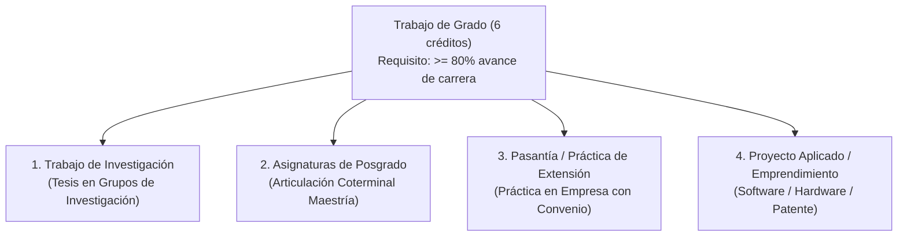

# Guía Integral del Estudiante: Ingeniería de Sistemas y Computación (Sede Bogotá)

Esta guía condensa todas las respuestas normativas, académicas y procedimentales que un estudiante de **Ingeniería de Sistemas y Computación** de la **Universidad Nacional de Colombia - Sede Bogotá** necesita conocer a lo largo de su carrera.

---

## 🎓 1. Opciones de Trabajo de Grado (6 Créditos)

En el plan de estudios vigente ([Acuerdo 011 de 2023 CF](https://legal.unal.edu.co/rlunal/home/doc.jsp?d_i=106142)), el **Trabajo de Grado** es una actividad obligatoria de **6 créditos** dentro del Componente Disciplinar. El estudiante puede inscribirlo tras haber superado al menos el **80% de avance de créditos** de la carrera (aproximadamente 132 créditos aprobados).

De acuerdo con la reglamentación de la Facultad de Ingeniería y el [Acuerdo 008 de 2008 CSU](https://legal.unal.edu.co/rlunal/home/doc.jsp?d_i=25418), existen **cuatro modalidades oficiales**:

### Modalidad 1: Trabajo de Investigación
- **En qué consiste**: Desarrollo de un proyecto investigativo experimental o teórico bajo la dirección de un docente de los grupos de investigación del departamento (MIDAS, DIS, Bioingeniería, etc.).
- **Entregable**: Documento escrito (monografía de investigación) y sustentación pública ante dos jurados evaluadores designados por el Comité Asesor.
- **Calificación**: Aprobado / Reprobado o con mención Meritoria / Laureada.

### Modalidad 2: Asignaturas de Posgrado (Modelo Coterminal)
- **En qué consiste**: El estudiante inscribe y cursa **al menos 6 u 8 créditos en asignaturas de posgrado** pertenecientes a la **Maestría en Ingeniería - Sistemas y Computación** u otros posgrados afines de la UNAL.
- **Requisitos**: Tener un **PAPA $\ge 4.0$** y contar con cupo disponible en las materias de posgrado.
- **Doble Beneficio**: Al aprobar las asignaturas de posgrado con nota $\ge 3.5$, se convalida el Trabajo de Grado de pregrado Y dichos créditos se acreditan para continuar directamente la maestría al graduarse (reduciendo un año de posgrado).

### Modalidad 3: Pasantía o Práctica de Extensión (Práctica Empresarial)
- **En qué consiste**: Vinculación laboral o de práctica en una empresa de tecnología o institución nacional o internacional que cuente con convenio marco con la Facultad de Ingeniería de la UNAL.
- **Requisitos**:
  - Mínimo 480 a 640 horas de labor técnica comprobada (un semestre a tiempo completo o parcial).
  - Aprobación previa de la propuesta de práctica por el Comité Asesor de Carrera.
  - Asignación de un **tutor empresarial** y un **docente director de la UNAL**.
- **Entregable**: Informe técnico final de práctica avalado por la empresa y presentación evaluada por el docente director.

### Modalidad 4: Proyecto Aplicado de Ingeniería o Emprendimiento
- **En qué consiste**: Creación de un producto de software de alto impacto, desarrollo de infraestructura cloud, hardware embebido, o la formulación de una empresa de base tecnológica (startup) validada con modelo de negocio.
- **Entregable**: Prototipo funcional probado, repositorio de código con buenas prácticas de arquitectura y documentación técnica rigurosa.

---

## 💼 2. Pasantías y Prácticas Empresariales como "Libre Elección"

Muchos estudiantes preguntan si pueden hacer una pasantía sin que sea su Trabajo de Grado:
* **SÍ ES POSIBLE**. La Facultad de Ingeniería permite registrar **Prácticas Académicas / Pasantías** con cargo al **Componente de Libre Elección** (habitualmente de 3 a 6 créditos).
* **Cómo funciona**:
  1. El estudiante ya tiene definida otra opción para su Trabajo de Grado (por ejemplo, investigación o materias de posgrado).
  2. Consigue una pasantía o práctica en una empresa y desea que la universidad le reconozca los créditos y el seguro estudiantil de riesgos laborales (ARL).
  3. Solicita ante el Comité Asesor la inscripción de la asignatura especial de *Práctica de Extensión en Libre Elección*.
  4. Los créditos obtenidos se abonan a sus **33 créditos de Libre Elección**.

---

## 🎨 3. El Componente de Libre Elección (33 Créditos)

En Ingeniería de Sistemas y Computación (Bogotá), el Componente de Libre Elección equivale exactamente al **20% del plan de estudios** (**33 créditos** de 165).

### ¿En qué se pueden gastar estos 33 créditos?
1. **Asignaturas de una Segunda Carrera (Doble Titulación)**: Es el uso más eficiente. Si cursas materias de Ciencias de la Computación, Matemáticas o Electrónica, te sirven para graduarte de Sistemas y avanzas en tu segunda carrera.
2. **Asignaturas de Posgrado**: Puedes matricular materias de la Maestría en Sistemas (hasta 12 créditos) y tenerlas listas para cuando ingreses al posgrado.
3. **Idiomas Oficiales**: Cursos de inglés, francés, alemán, japonés, italiano, portugués, etc., dictados por el Departamento de Lenguas Extranjeras (DLEX) de la Facultad de Ciencias Humanas.
4. **Asignaturas de Interés General**: Materias de Ciencias Económicas (Finanzas, Emprendimiento), Artes (Diseño Gráfico, Música), Ciencias Humanas (Filosofía, Sociología) o Ciencias (Astronomía, Física Cuántica).
5. **Profundizaciones Técnicas de Sistemas**: Materias electivas adicionales de la misma carrera (Deep Learning, Cloud Computing, Ciberseguridad Ofensiva).

---

## 📈 4. Métricas Académicas: PAPI, PAPA, PA y Cupo de Créditos

El [Acuerdo 008 de 2008 CSU (Estatuto Estudiantil)](https://legal.unal.edu.co/rlunal/home/doc.jsp?d_i=25418) define con precisión matemática el rendimiento del estudiante:

### A. PAPI (Promedio Aritmético Ponderado del Período)
$$\text{PAPI} = \frac{\sum_{i=1}^{k} (\text{Nota}_i \times \text{Créditos}_i)}{\sum_{i=1}^{k} \text{Créditos}_i}$$
* Se calcula **únicamente con las asignaturas cursadas en el período semestral actual**.
* **Impacto**: Determina si el estudiante recibe estímulos semestrales (matrícula de honor) o si entra en riesgo académico.

### B. PAPA (Promedio Aritmético Ponderado Acumulado)
$$\text{PAPA} = \frac{\sum_{j=1}^{n} (\text{Nota}_j \times \text{Créditos}_j)}{\sum_{j=1}^{n} \text{Créditos}_j}$$
* Se calcula sobre **la totalidad de asignaturas cursadas en la historia académica**, incluyendo materias reprobadas.
* **Impacto Crítico**:
  - **Doble Titulación**: Se exige un PAPA $\ge 4.0$ en la Facultad de Ingeniería.
  - **Materias de Posgrado / Coterminal**: Se exige PAPA $\ge 4.0$.
  - **Cita del SIA**: El turno para inscribir materias en el SIA se asigna de mayor a menor PAPA.
  - **Pérdida de Cupo**: Si el PAPA acumulado cae por debajo de **3.0**, el estudiante pierde el cupo en la universidad.
  - **Grado de Honor y Beca de Posgrado**: El mejor PAPA de cada promoción obtiene exención total del 100% en los derechos de matrícula para cursar maestría o doctorado en la UNAL.

### C. PA (Promedio Aritmético Ponderado de Avance)
* Se calcula considerando **únicamente las asignaturas aprobadas que forman parte del plan de estudios**.

### D. Cupo de Créditos y "Bolsa de Créditos"
* Al ingresar a Ingeniería de Sistemas, el sistema SIA te asigna un **cupo inicial de 165 créditos**.
* **Mecánica**:
  - Si inscribes una materia de 3 créditos y la **apruebas**, esos 3 créditos se abonan a tu avance y recuperas cupo en tu bolsa de créditos.
  - Si inscribes una materia de 3 créditos y la **repruebas**, esos 3 créditos se restan definitivamente de tu cupo disponible.
  - Si agotas tu cupo de créditos disponibles sin haber culminado el plan de estudios, incurres en causal de **pérdida de cupo por créditos**.
  - Los estudiantes que ingresan a Doble Titulación reciben una **adición formal a su bolsa de créditos** mediante resolución del Consejo de Sede.

---

## 🛠️ 5. Trámites Críticos que Todo Estudiante Debe Conocer

### A. Cancelación de Asignaturas
1. **Cancelación Ordinaria**: Se realiza de forma autónoma por el estudiante en el portal SIA durante las primeras semanas del semestre (según el calendario académico oficial), sin necesidad de justificación y sin que afecte el PAPA.
2. **Cancelación Extemporánea**: Se solicita después de vencerse el plazo ordinario ante el Consejo de Facultad de Ingeniería. Requiere causa justificada documentada (enfermedad grave con incapacidad médica de Unisalud, calamidad doméstica o fuerza mayor comprobable).

### B. Reserva de Cupo (Aplazamiento de Semestre)
* Si un estudiante no puede continuar sus estudios en un período, debe solicitar formalmente **Reserva de Cupo** a través del SIA antes de las fechas límite fijadas por el Consejo de Sede.
* Se pueden solicitar hasta un máximo de **dos (2) períodos académicos** (consecutivos o no). No afecta el PAPA ni la historia académica.

### C. Pérdida de Cupo y Readmisión
* **Causales de Pérdida de Cupo** ([Art. 43 Acuerdo 008/2008 CSU](https://legal.unal.edu.co/rlunal/home/doc.jsp?d_i=25418)):
  1. Obtener un PAPA menor a 3.0 al cierre del período.
  2. No disponer de cupo de créditos para inscribir las asignaturas pendientes del plan.
  3. Reprobar por segunda vez una misma asignatura sin contar con créditos disponibles.
  4. Sanción disciplinaria de expulsión o suspensión.
* **Readmisión**: El estudiante que pierde cupo por motivos académicos puede solicitar una única vez el reingreso o readmisión cumpliendo las condiciones fijadas por el Consejo de Sede.

---

## ❓ Preguntas Frecuentes para Motores RAG (Q&A)

**P: ¿Puedo hacer mi Trabajo de Grado en Sistemas cursando materias de maestría?**  
*R: Sí. De acuerdo con el Acuerdo 011 de 2023 de la Facultad de Ingeniería, los estudiantes con PAPA >= 4.0 pueden cursar entre 6 y 8 créditos en la Maestría en Sistemas para cumplir con el Trabajo de Grado y adelantar su posgrado (coterminal).*

**P: ¿Puedo meter una pasantía empresarial en mis créditos de Libre Elección?**  
*R: Sí. Si tu Trabajo de Grado es mediante otra modalidad (ej. materias de posgrado o tesis), puedes inscribir una práctica o pasantía empresarial con convenio formal como una asignatura de Libre Elección (3 a 6 créditos) ante el Comité Asesor.*

**P: ¿Qué pasa si mi PAPA acumulado baja de 3.0?**  
*R: El estudiante incurre en causal de pérdida de cupo de acuerdo con el artículo 43 del Acuerdo 008 de 2008 del Consejo Superior Universitario (Estatuto Estudiantil).*

**P: ¿Cuál es la diferencia entre PAPI y PAPA?**  
*R: El PAPI es el promedio ponderado semestral (solo las notas del período actual), mientras que el PAPA es el promedio acumulado de toda la historia académica (incluidas materias reprobadas) y determina el cupo para doble titulación, posgrados y cita del SIA.*
