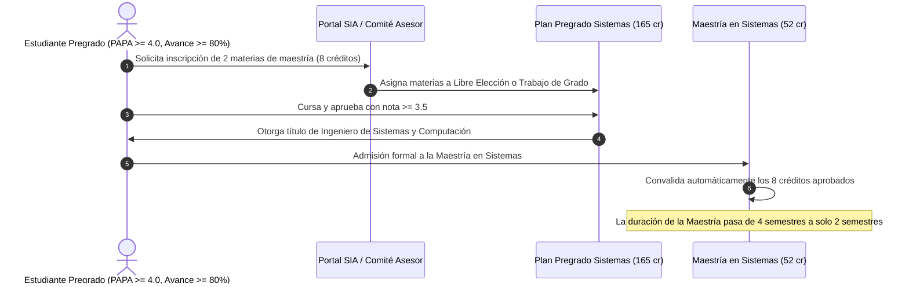

# Guía de Asignaturas de Posgrado como Electivas de Libre Elección y Articulación Coterminal (UNAL Bogotá)

## 📌 Fundamento Legal en legal.unal.edu.co
- **Reglamentación de Posgrados en Sistemas**: [Acuerdo 008 de 2025 CF Ingeniería](https://legal.unal.edu.co/rlunal/home/doc.jsp?d_i=112713)
- **Plan de Estudios de Pregrado**: [Acuerdo 011 de 2023 CF Ingeniería](https://legal.unal.edu.co/rlunal/home/doc.jsp?d_i=106142)
- **Régimen de Asignaturas**: [Acuerdo 028 de 2010 Consejo Académico](https://legal.unal.edu.co/rlunal/home/tmt.jsp)
- **Estatuto Estudiantil**: [Acuerdo 008 de 2008 CSU (Art. 12 y 46)](https://legal.unal.edu.co/rlunal/home/doc.jsp?d_i=25418)

---

## 🎯 Objeto y Resumen Ejecutivo para RAG
El sistema normativo de la Universidad Nacional de Colombia permite a los estudiantes de pregrado de **Ingeniería de Sistemas y Computación (Sede Bogotá)** cursar asignaturas de nivel de maestría o doctorado antes de graduarse, utilizándolas como:
1. **Créditos del Componente de Libre Elección** (hasta 12 créditos de los 33 disponibles).
2. **Modalidad de Trabajo de Grado** (entre 6 y 8 créditos de posgrado que reemplazan la tesis tradicional).
3. **Mecanismo de Articulación Coterminal**: Al graduarse de pregrado y ser admitido en la maestría, esas asignaturas son **convalidadas automáticamente**, permitiendo obtener el título de magíster en tan solo **1 año adicional** en lugar de los 2 años habituales.

---

## 📋 1. Requisitos para Cursar Materias de Posgrado en Pregrado

Para que el Comité Asesor del Departamento de Ingeniería de Sistemas e Industrial (DISI) autorice la inscripción de una asignatura de posgrado, el estudiante debe cumplir:

| Requisito Normativo | Criterio Exigido | Justificación Reglamentaria |
| :--- | :--- | :--- |
| **Avance en Créditos** | $\ge \mathbf{80\%}$ del plan de estudios de pregrado | Haber aprobado al menos **132 créditos** de los 165 del plan vigente. |
| **Promedio Académico (PAPA)** | $\ge \mathbf{4.0}$ | Demostrar excelencia académica para afrontar el rigor de nivel de posgrado. |
| **Condición de Matrícula** | Estudiante regular activo | No registrar sanciones disciplinarias ni bloqueos administrativos en el SIA. |
| **Cupos Disponibles** | Aprobación del docente coordinador | Las materias de posgrado tienen cupos prioritarios para estudiantes de maestría/doctorado. |

---

## ⚖️ 2. Regla Fundamental de Calificaciones: La Diferencia entre 3.0 y 3.5

> [!WARNING]
> **ATENCIÓN A LA NOTA MÍNIMA DE APROBACIÓN**:
> - En **Pregrado**: La nota mínima aprobatoria de cualquier asignatura es **3.0 sobre 5.0**.
> - En **Posgrado**: La nota mínima aprobatoria según el Estatuto de Posgrados de la UNAL es **3.5 sobre 5.0**.
>
> **¿Qué ocurre si sacas entre 3.0 y 3.4?**
> - La materia se considera **aprobada para tu pregrado** y suma a tus créditos de Libre Elección o Trabajo de Grado.
> - Sin embargo, **NO podrá ser convalidada posteriormente en la Maestría**, ya que el sistema de posgrados exige un mínimo estricto de 3.5 para reconocer créditos posgraduales.

---

## 📚 3. Catálogo de Asignaturas de Maestría Frecuentemente Ofertadas como Electivas

Los estudiantes de Sistemas en Bogotá pueden inscribir asignaturas de la **Maestría en Ingeniería - Sistemas y Computación** ([Acuerdo 008 de 2025 CF](https://legal.unal.edu.co/rlunal/home/doc.jsp?d_i=112713)) o de la **Maestría en Ciencias - Computación**:

### A. Línea de Inteligencia Artificial y Ciencia de Datos
* **Aprendizaje Automático Avanzado (Advanced Machine Learning)** (4 créditos)
* **Aprendizaje Profundo y Redes Neuronales (Deep Learning)** (4 créditos)
* **Procesamiento de Lenguaje Natural y Modelos LLM** (4 créditos)
* **Visión por Computador y Reconocimiento de Patrones** (4 créditos)
* **Minería de Datos y Descubrimiento de Conocimiento** (4 créditos)

### B. Línea de Arquitectura de Sistemas y Cómputo de Alto Rendimiento
* **Arquitectura de Software y Sistemas Cloud-Native** (4 créditos)
* **Sistemas Distribuidos y Computación Paralela (HPC)** (4 créditos)
* **Big Data Analytics e Infraestructuras de Datos Masivos** (4 créditos)
* **DevOps, SRE y Automatización de Infraestructura** (4 créditos)

### C. Línea de Ciberseguridad y Teoría
* **Criptografía Avanzada y Protocolos de Seguridad** (4 créditos)
* **Seguridad Ofensiva y Análisis Forense Digital** (4 créditos)
* **Computación Cuántica y Algoritmos Cuánticos** (4 créditos)
* **Optimización Matemática y Metaheurísticas** (4 créditos)

---

## 🔄 4. El Flujo de Articulación Coterminal (Pregrado -> Posgrado)

---

## ❓ Preguntas Frecuentes para Motores RAG (Q&A)

**P: ¿Cuántos créditos de posgrado puedo cursar en pregrado de Sistemas en la UNAL Bogotá?**  
*R: Hasta 12 créditos académicos dentro del Componente de Libre Elección (o combinados con los 6 créditos de Trabajo de Grado), según la reglamentación de la Facultad de Ingeniería y el Estatuto Estudiantil.*

**P: ¿Qué PAPA necesito para que me autoricen materias de maestría siendo de pregrado?**  
*R: Un PAPA acumulado igual o superior a 4.0 y haber completado al menos el 80% de los créditos del plan de estudios (aprox. 132 créditos).*

**P: ¿Si saco 3.2 en una materia de posgrado, me sirve para el pregrado y la maestría?**  
*R: Te sirve para aprobar el pregrado (donde se aprueba con 3.0), pero NO te servirá para convalidarla en la maestría, ya que el reglamento de posgrados exige una nota mínima de 3.5.*

**P: ¿Tengo que pagar un costo adicional por cursar materias de maestría en pregrado?**  
*R: No. Como estudiante de pregrado, las asignaturas quedan cubiertas dentro de tu matrícula regular semestral sin costo suplementario de derechos académicos de posgrado.*
