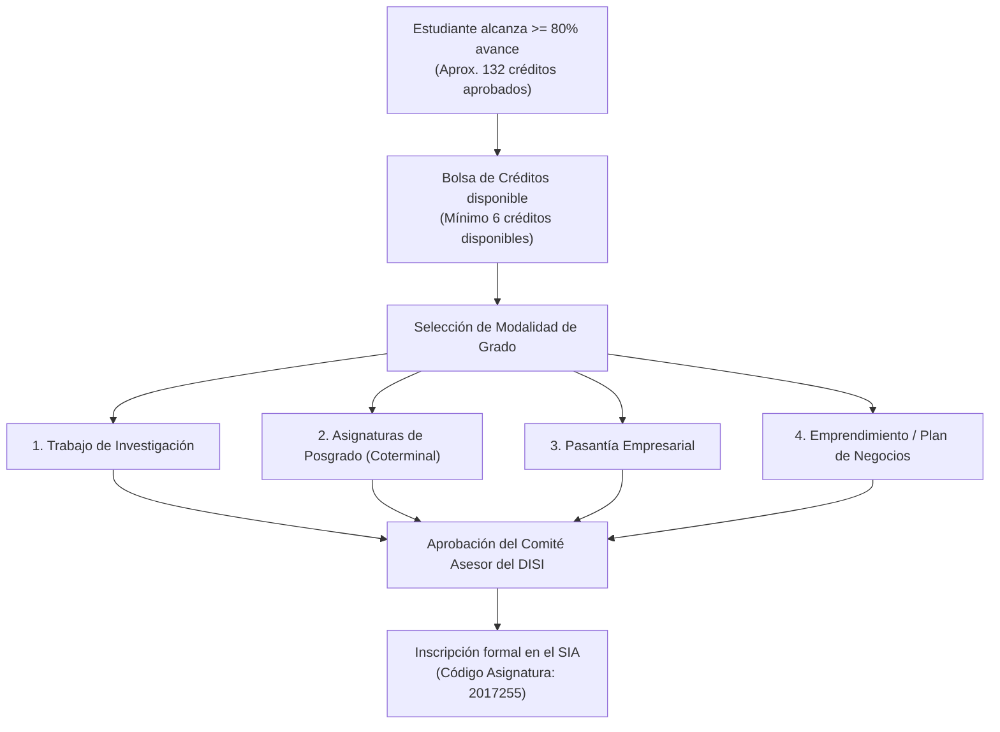
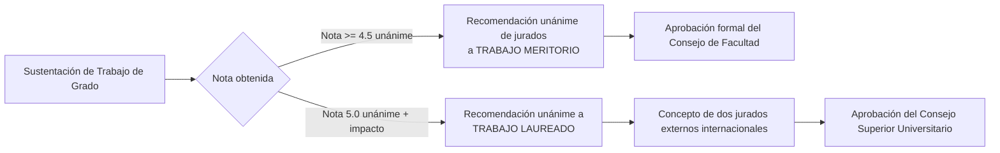

# Guía Exhaustiva de Opciones de Trabajo de Grado y Titulación (Sistemas Bogotá)

Esta guía detalla las cuatro vías reglamentarias que tiene un estudiante de **Ingeniería de Sistemas y Computación** de la **Universidad Nacional de Colombia - Sede Bogotá** para culminar su ciclo formativo, obtener su titulación y optar por distinciones académicas, conforme al **Acuerdo 026 de 2012 del Consejo de Facultad de Ingeniería** y el **Acuerdo 011 de 2023 CF**.

---

## 📌 1. Marco General y Requisitos de Inscripción

En el plan de estudios vigente (165 créditos), la asignatura **Trabajo de Grado** es una actividad obligatoria de **6 créditos** ubicada en el Componente Disciplinar o Profesional.

### Requisitos Indispensables:
1. **Porcentaje de Avance**: Haber aprobado al menos el **80% de los créditos totales** del plan de estudios (mínimo 132 créditos de los 165).
2. **Cupo de Créditos**: Disponer de al menos **6 créditos disponibles** en la bolsa de créditos para realizar la inscripción formal en el Sistema de Información Académica (SIA).
3. **Aval del Comité Asesor del DISI**: Toda modalidad requiere la presentación de una propuesta formal o plan de trabajo avalado previamente por el Comité Asesor del Programa Curricular de Ingeniería de Sistemas y Computación.

---

## 🔍 2. Las Cuatro Modalidades Oficiales al Detalle

### Modalidad 1: Trabajo de Investigación (Monografía / Tesis)
* **Objetivo**: Desarrollar un proyecto de indagación científica, innovación técnica o desarrollo metodológico original articulado a los grupos de investigación del DISI (MIDAS, DIS, GICS, MindLab, Bioingeniería).
* **Fases del Proceso**:
  1. *Formulación del Anteproyecto*: Definición de problema, objetivos, justificación, estado del arte, metodología y cronograma bajo la dirección de un docente de planta o transitorio del DISI.
  2. *Radicación y Aprobación*: Envío de la propuesta al Comité Asesor de Carrera.
  3. *Ejecución*: Desarrollo experimental, prototipado y redacción del documento monográfico final.
  4. *Evaluación*: Dos jurados evaluadores designados por el Comité Asesor emiten concepto escrito.
  5. *Sustentación Pública*: Exposición oral de 30-40 minutos ante los jurados y la comunidad académica.
* **Calificación**: Escala de 0.0 a 5.0. Se aprueba con nota mínima de **3.0**.

### Modalidad 2: Asignaturas de Posgrado (Vía Coterminal / Articulación a Maestría)
* **Objetivo**: Permitir al estudiante con alto rendimiento académico cursar materias del nivel de posgrado durante su pregrado, articulando la finalización de la carrera con el inicio de una maestría.
* **Requisitos Particulares**:
  - Tener un **PAPA $\ge 4.0$** al momento de la postulación.
  - Inscribir y cursar **al menos dos asignaturas de posgrado (mínimo 6 u 8 créditos)** de la oferta de la **Maestría en Ingeniería - Sistemas y Computación** o posgrados afines de la UNAL.
* **Criterio de Aprobación**:
  - En posgrado, la nota mínima aprobatoria por norma universitaria es **3.0**, pero para que convaliden como Trabajo de Grado de pregrado se exige aprobar **todas las asignaturas de posgrado inscritas con calificación igual o superior a 3.5**.
* **Doble Aprovechamiento**:
  - Cumplido lo anterior, se registra la nota promedio en la asignatura de Trabajo de Grado del pregrado.
  - Al graduarse e ingresar formalmente a la Maestría en Sistemas, dichos créditos de posgrado cursados se homologan automáticamente, permitiendo terminar la maestría en solo un año adicional.

### Modalidad 3: Práctica de Extensión / Pasantía Empresarial
* **Objetivo**: Aplicar los conocimientos de ingeniería en un entorno productivo real, resolviendo problemas tecnológicos concretos en una empresa o entidad externa.
* **Requisitos Particulares**:
  - Empresa con **Convenio Marco o Acuerdo Específico vigente** con la Facultad de Ingeniería (gestionado ante la OERI).
  - Cumplir un mínimo de **480 a 640 horas de labor técnica comprobada** durante el período académico.
  - Asignación de un **tutor empresarial** en la compañía (profesional en ingeniería o área afín) y un **docente director en la UNAL**.
  - Afiliación obligatoria a la Administradora de Riesgos Laborales (ARL) por cuenta de la empresa (Decreto 055 de 2015).
* **Entregables**:
  - Plan de trabajo técnico aprobado al inicio del semestre.
  - Informe técnico final de pasantía avalado por el tutor empresarial.
  - Presentación y sustentación del informe técnico final ante el docente director de la UNAL.

### Modalidad 4: Plan de Negocios y Emprendimiento de Base Tecnológica
* **Objetivo**: Fomentar la creación de empresas innovadoras (spin-offs / startups) concebidas a partir de desarrollos de software, plataformas de datos o soluciones de hardware de autoría estudiantil.
* **Requisitos Particulares**:
  - Presentar la propuesta con el aval del **Programa de Emprendimiento e Innovación** de la Facultad de Ingeniería.
  - Presentar un **Producto Mínimo Viable (MVP)** funcional, estudio de factibilidad técnica y financiera, plan de comercialización y registro de propiedad intelectual.
  - Evaluación ante un panel mixto de evaluadores técnicos y expertos en modelo de negocio.

---

## 🎖️ 3. Distinciones Académicas: Trabajo de Grado Meritorio y Laureado

El Estatuto Estudiantil ([Acuerdo 008 de 2008 CSU](https://legal.unal.edu.co/rlunal/home/doc.jsp?d_i=25418), Art. 48) contempla dos reconocimientos de honor para trabajos de excelencia excepcional:

1. **Trabajo de Grado Meritorio**:
   - Requiere calificación sobresaliente (típicamente $\ge 4.5$) y solicitud escrita unánime de los jurados justificando la calidad técnica e investigativa superior.
   - Es ratificado mediante resolución del **Consejo de Facultad de Ingeniería**.
   - Queda consignado explícitamente en el diploma y acta de grado.
2. **Trabajo de Grado Laureado**:
   - Es la máxima distinción académica de pregrado en la Universidad Nacional.
   - Requiere calificación de **5.0 unánime**, más una contribución científica excepcional demostrada (e.g., patente radicada, publicación en revista internacional indexada de primer cuartil Q1, o impacto nacional masivo).
   - Requiere dictamen positivo de evaluadores externos internacionales y ratificación por el **Consejo Superior Universitario (CSU)**.

---

## ⏱️ 4. Temporalidad, Prórrogas y Calificación "En Desarrollo"

* **Duración Normal**: El Trabajo de Grado está diseñado para ejecutarse en **un período académico semestral (16 semanas)**.
* **Prórroga Administrativa ("En Desarrollo")**:
  - Si por la complejidad experimental o extensión justificada del proyecto el estudiante no finaliza en el semestre ordinario, el docente director puede solicitar al Comité Asesor la calificación transitoria de **"En Desarrollo" (ED)**.
  - La calificación "En Desarrollo" concede **un semestre adicional inmediato** para concluir y sustentar el trabajo.
  - **Ventaja de Créditos**: Durante el semestre de prórroga con calificación "En Desarrollo", el estudiante no requiere gastar nuevamente créditos de su bolsa para inscribir la materia, pagando únicamente los costos mínimos de matrícula administrativa.

---

## 📜 5. Ruta de Grado y Trámites de Titulación en el SIA

Una vez aprobado y calificado el Trabajo de Grado en el SIA (con nota $\ge 3.0$), el estudiante ingresa a la fase de titulación:

1. **Revisión del Porcentaje de Avance (100%)**:
   - Verificar en el SIA que se haya cumplido el 100% de los 165 créditos (39 cr Fundamentación + 93 cr Disciplinar + 33 cr Libre Elección).
   - Requisito de idioma extranjero certificado (Inglés nivel B1/B2 según resolución de facultad).
2. **Paz y Salvos Electrónicos en el SIA**:
   - Paz y salvo de la **Biblioteca Central Gabriel García Márquez** (devolución de libros y entrega digital del documento de trabajo de grado en el repositorio institucional).
   - Paz y salvo de los **Laboratorios del DISI** (entrega de inventarios o equipos prestados).
   - Paz y salvo del área de **Finanzas y Tesorería**.
3. **Inscripción a Ceremonia de Grado**:
   - Postulación electrónica en el SIA en los períodos fijados por la Secretaría de Sede (habitualmente grados en abril, julio, septiembre y diciembre).
   - Pago de los derechos de grado y expedición de diploma oficial y acta de grado.

---

## ❓ 6. Preguntas Frecuentes para Motores RAG (Q&A Pairs)

### P1: ¿Qué ocurre si repruebo el Trabajo de Grado?
**R:** Si el trabajo es calificado con nota inferior a 3.0, la asignatura se considera reprobada y la nota numérica afecta negativamente el PAPI y PAPA del semestre. El estudiante deberá volver a inscribir los 6 créditos de Trabajo de Grado en el siguiente semestre, pudiendo cambiar de tema, de director o de modalidad de grado.

### P2: ¿Puedo hacer mi Trabajo de Grado en parejas?
**R:** En la Modalidad de Investigación y en la Modalidad de Emprendimiento/Plan de Negocios, el Comité Asesor del DISI permite trabajos en grupos de **máximo dos (2) estudiantes**, siempre que la propuesta demuestre una carga de trabajo robusta y delimite con absoluta claridad las responsabilidades y aportes individuales de cada autor. En la Modalidad de Asignaturas de Posgrado la evaluación es estrictamente individual.

### P3: ¿Puedo inscribir Trabajo de Grado si debo materias de primer semestre?
**R:** Sí, siempre y cuando cumplas con el **80% de avance total de créditos** del plan de estudios y no exista una correlación directa de prerrequisito insatisfecho en la malla curricular. Sin embargo, no podrás recibir el título hasta que apruebes el 100% de las asignaturas obligatorias.

---
*Documento normativo de referencia para la culminación académica y titulación en Ingeniería de Sistemas y Computación - Universidad Nacional de Colombia.*
